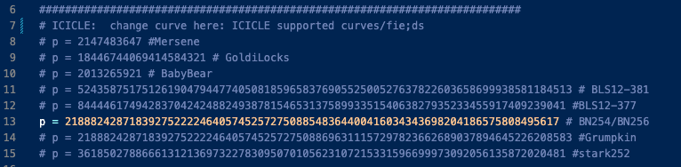
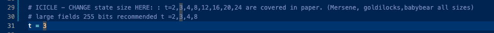
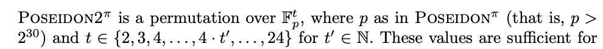
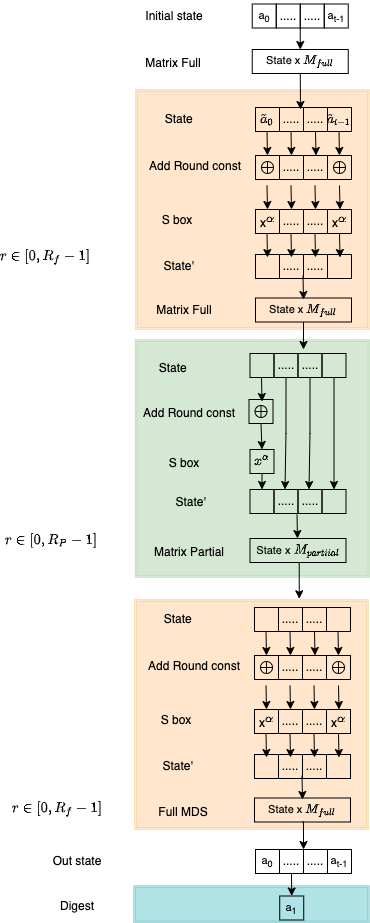
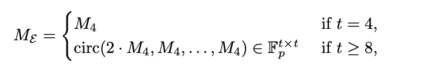
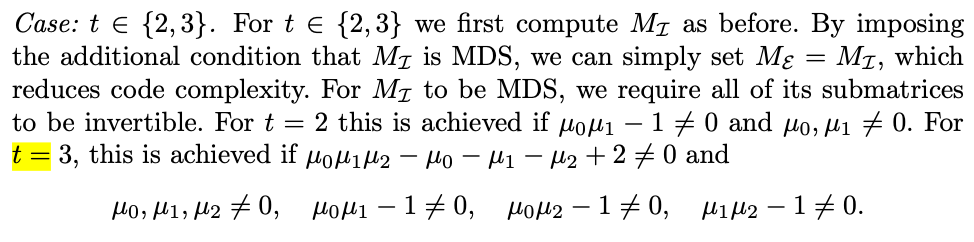
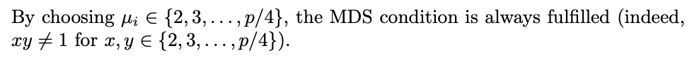

# Poseidon 2 hash 

This folder contains data for poseidon2 hash. Run the code

```
sage poseidon2_rust_params.sage 

```
to run the code. Here the parameters that can be changed in [Poseidon2/poseidon2_rust_params.sage](/Poseidon2/poseidon2_rust_params.sage). 

* choose prime by commenting/uncommenting with "#"

* choose state size $t$


eg
```
sage poseidon2_rust_params.sage &>filename.txt

```
will print all the hash data in a file "filename.txt"

* Full/partial matrix.
* ROund constants, round numbers, alpha
* test vectors and results. 

In the following folders the data for all supported curves/fields for the relevant state sizes can be found 
[t=2](Poseidon2/poseidon2_parameters_t2), [t=3](/Poseidon2/poseidon2_parameters_t3),[t=4](/Poseidon2/poseidon2_parameters_t4), [t=8](/Poseidon2/poseidon2_parameters_t8),[t=12](/Poseidon2/poseidon2_parameters_t12), [t=16](/Poseidon2/poseidon2_parameters_t16), [t=20](/Poseidon2/poseidon2_parameters_t20), [t=24](/Poseidon2/poseidon2_parameters_t24)


## Poseidon 2 structure





The code is taken from the [implementation](https://github.com/HorizenLabs/poseidon2/blob/bb476b9ca38198cf5092487283c8b8c5d4317c4e/poseidon2_rust_params.sage#L579) following the paper [Poseidon2](https://eprint.iacr.org/2023/323.pdf)

## State size and round numbers for icicle curves

Summarized [here](https://docs.google.com/spreadsheets/d/1p7h7f3SudR_o8ueSJ9nGPjQTmQV82QCFjX-m61gRQqU/edit?gid=0#gid=0)

## Round constants

* In the first full round and last full rounds Round constants are of the structure $[c_0,c_1,\ldots , c_{t-1}]$
* In the partial rounds the round constants is only added to first element $[\tilde{c}_0,0,0,\ldots, 0_{t-1}]$


## S box

Allowed values of $\alpha$ for a given prime is the smallest integer such that
$$gcd(\alpha,p-1)=1$$

For ICICLE supported curves/fields

* Mersene $\alpha = 5$
* Goldilocks $\alpha =7$
* Babybear $\alpha=7$
* Bls12-377 $\alpha =11$
* Bls12-381 $\alpha=5$
* BN254 $\alpha = 5$
* Grumpkin $\alpha = 5$
* Stark252 $\alpha=3$

## MDS matrix structure

There are only two matrices: There is one type of matrix for full round and another for partial round. There are two cases available one for state size $t'=4\cdot t$ and another for $t=2,3$.

### $t=4\cdot t'$ where $t'$ is an integer.


**Full Matrix** $M_{full}$ (Referred in paper as $M_{\mathcal{E}}$). These are hard coded (same for all primes $p>2^{30}$) for any fixed state size $t=4\cdot t'$ where $t'$ is an integer. 
 
$$
M_{4} = \begin{pmatrix}
5 & 7 & 1 & 3 \\
4& 6 & 1 & 1 \\
1 & 3 & 5 & 7\\
1 & 1 & 4 & 6\\
\end{pmatrix} $$

As per the [paper](https://eprint.iacr.org/2023/323.pdf) and the [code](https://github.com/HorizenLabs/poseidon2/blob/main/poseidon2_rust_params.sage) this structure is always maintained and is always MDS for any prime $p>2^{30}$. So for a given state size $t$ the $M_{full}$ is the SAME for all prime $p$.  

eg for $t=8$ the matrix looks like

$$
M_{full}^{8\times 8} = \begin{pmatrix}
2\cdot M_4 & M_4 \\
M_4 & 2\cdot M_4 \\
\end{pmatrix} $$

**Partial Matrix** $M_{partial}$(referred in paper as $M_{\mathcal{I}}$) - There is only ONE partial matrix for all the partial rounds and has non zero diagonal entries along the diagonal and $1$ everywhere else.

$$
M_{Partial}^{t\times t} = \begin{pmatrix}
\mu_0 &1 & \ldots & 1 \\
1 &\mu_1 & \ldots & 1 \\
\vdots & \vdots & \ddots & \vdots \\
 1 & 1 &\ldots & \mu_{t-1}\\
\end{pmatrix} $$

where $\mu_i \in \mathbb{F}$. In general this matrix is different for each prime since one has to find values that satisfy some inequalities in a field. However unlike Poseidon there is only one $M_{partial}$ for all partial rounds. 

### $t=2,3$

These are special state sizes. 

#### $t=3$

In all ICICLE supported curves we get for $t=3$ , see [Poseidon2/poseidon2_parameters_t3](/Poseidon2/poseidon2_parameters_t3)

$$M_{full} = \begin{pmatrix}
2 & 1 &  1 \\
1 & 2 & 1 \\
1 & 1 & 2 \\
\end{pmatrix} \ , \ M_{Partial} = \begin{pmatrix}
2 & 1 &  1 \\
1 & 2 & 1 \\
1 & 1 & 3 \\
\end{pmatrix}$$


#### $t=2$

In all ICICLE supported curves we get for $t=2$ [/Poseidon2/poseidon2_parameters_t2](/Poseidon2/poseidon2_parameters_t2)

$$M_{full} = \begin{pmatrix}
2 & 1 \\
1 & 2 \\
\end{pmatrix} \ , \ M_{Partial} = \begin{pmatrix}
2 & 1  \\
1 & 3  \\
\end{pmatrix}$$

#### NOTE


According to the paper, for $t=2,3$ it is possible to choose $M_{Full} = M_{Partial}$, and the result is still a valid hash and satsifies all security conditions, but we did not see this as a choice in the official [implementation](https://github.com/HorizenLabs/poseidon2/blob/bb476b9ca38198cf5092487283c8b8c5d4317c4e/poseidon2_rust_params.sage#L579). As long as the inequalities for $\mu_i$ are satisfied, it is considered a valid matrix. One choice is simply


some user can define his MDS this way as well in future. 

The poseidon2 hash seems to be emphasizing efficient arithmetization, however it seems rather a simple permutation and yet to see if it will survive the test of time and remain secure. 
