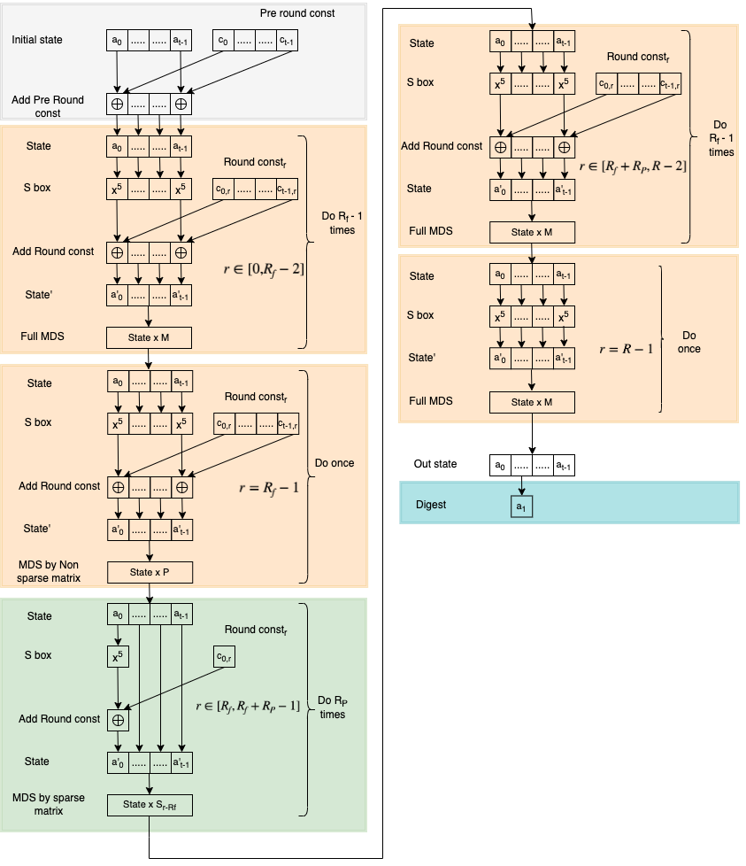
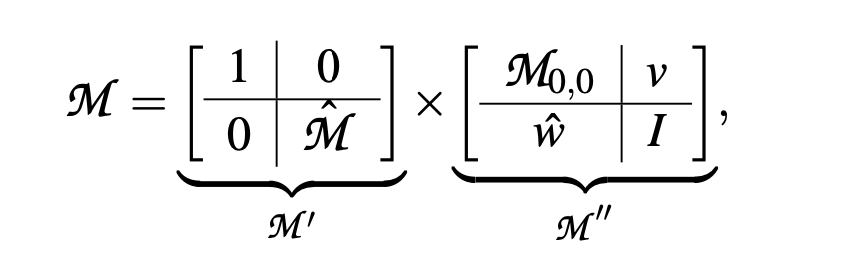

# Generated data

For icicle supported curves/fields

1. bare parameters are in [bare_parameters_t3](bare_parameters_t3)
2. optimized parameters are in [optimized_parameters_t3](optimized_parameters_t3)
3. poseidon hash for bare and optimized can be found in [poseidon_t3](poseidon_t3)

For sage to run in terminal, it needs python venv with some packages. most dependencies are part of the [Ingonyama poseidon hash package](https://pypi.org/project/poseidon-hash/), so it is easy to just install it, since it installs numpy,numba etc all required by sage. But all data generated in this repository comes from first principles implementation of poseidon hash found [here](https://extgit.iaik.tugraz.at/krypto/hadeshash)

# Field data

We have generated here for common use case for $t=3$, use this example to generate parameters for different $t$ as required. 

Allowed Sbox is $\alpha=3$ if $p\neq 1\mod 3$ or $\alpha=5$ if $p=1\mod 3$ , $p\neq 1 \mod 5$, using either of these in the sage will generate different parameters. $\alpha=5$ is most common with 128 bits according to poseidon paper. 

* [bls12_377](https://docs.rs/ark-bls12-377/latest/ark_bls12_377/)
  * 253 bit prime: 8444461749428370424248824938781546531375899335154063827935233455917409239041
  * hex: 0x12AB655E9A2CA55660B44D1E5C37B00159AA76FED00000010A11800000000001

* [bls12_381](https://docs.rs/ark-bls12-381/latest/ark_bls12_381/)
  * 255 bit prime: 52435875175126190479447740508185965837690552500527637822603658699938581184513
  * hex: 0x73EDA753299D7D483339D80809A1D80553BDA402FFFE5BFEFFFFFFFF00000001

* [bn254](https://docs.rs/ark-bn254/latest/ark_bn254/)
  * 254 bit prime: 21888242871839275222246405745257275088548364400416034343698204186575808495617
  * hex: 0x30644E72E131A029B85045B68181585D2833E84879B9709143E1F593F0000001

* [bw6_761](https://docs.rs/ark-bw6-761/latest/ark_bw6_761/)
  * 377 bit prime: 258664426012969094010652733694893533536393512754914660539884262666720468348340822774968888139573360124440321458177
  * hex: 0x1AE3A4617C510EAC63B05C06CA1493B1A22D9F300F5138F1EF3622FBA094800170B5D44300000008508C00000000001

* [grumpkin](https://docs.rs/ark-grumpkin/latest/ark_grumpkin/)
  * 254 bits prime: 21888242871839275222246405745257275088696311157297823662689037894645226208583
  * hex: 0x30644E72E131A029B85045B68181585D97816A916871CA8D3C208C16D87CFD47

* Goldilocks
  * 64 bit prime: 18446744069414584321
  * hex: 0xFFFFFFFF00000001

* Baby bear
  * 31 bit prime: 2013265921
  * hex: 0x78000001

* m31
  * 31 bit prime: 2147483647
  * hex: 0x7FFFFFFF

* STARK 252
  * 252 bit $p = 2^{251} + 17 * 2^{192} + 1 = 3618502788666131213697322783095070105623107215331596699973092056135872020481$
  * hex 0x800000000000011000000000000000000000000000000000000000000000001
  * take parameters from [here](https://github.com/starkware-industries/poseidon), this is the only case we have $\alpha=3$  since $p\neq 1 \mod 3$

# Bare Parameter generation

Generate bare parameters using the sage script [generate_params_poseidon.sage](generate_params_poseidon.sage), in most cases one may have different $t$ sizes, and rarely $\alpha$. This script can generate bare parameters for any $t$.

**usage:** sage generate_params_poseidon.sage 1 <s_box> <field_size> <num_cells> <_alpha> <security_level> <modulus_hex>"

* Note: the first argument is $1$ always for $GF(p)$ which is our case of interest.
* <s_box>: $0$ if $x^\alpha$ (always) , Update: $1$ if $x^{-1}$ (redacted -not used)
* <field_size>: bit size $\log_2 p$
* <num_cells>: state size of hash $t$
* <_alpha> in all practical cases $\alpha=5$
* <security_level> we generate params for $M=128$ bit security by default.
* <modulus_hex> prime field modulus in hex

example:

  * param for $t=3$, $\alpha=5$ for Bn254, prime field is 254 bit

  ```
  sage generate_params_poseidon.sage 1 0 254 3 5 128 0x30644E72E131A029B85045B68181585D2833E84879B9709143E1F593F0000001
  ```
will generate `poseidon_params_n254_t3_alpha5_M128.txt` with bare unoptimized parameters. For all icicle supported curves/fields bare parameters for $t=3$ can be found in [bare_parameters_t3](bare_parameters_t3)

# Optimized Poseidon

The optimization is because in partial rounds, the non linear S box only acts on one element. Allowing us to peel off linear layers unaffected by S box, especially in the MDS matrix and make it sparse. We may change the round constants and define round specific hashes as long as the output is the same.



## Optimized parameter generation

From the [Poseidon](https://eprint.iacr.org/2019/458.pdf) Appendix B, $M'$ is the presparse matrix, and $M''$ are the sparse matrices. $M_{0,0}$ is a constant for all sparse matrices in the partial rounds for a given field and $t$ size. 



We simply print the results from the [script](https://extgit.iaik.tugraz.at/krypto/hadeshash/-/blob/master/code/poseidonperm_x3_64_24_optimized.sage) by changing the relevant parameters. The results for all ICICLE supported curves/fields for $t=3$ is in [optimized_parameters_t3](optimized_parameters_t3)

**Go to folder poseidon_t3**

```
sage poseidon_bn254_n254_t3_alpha5_M128.sage
```

and it will print a file named `optimized_poseidon_params_n254_t3_alpha5_M128.txt` with the following data

1. Optimized round constants
2. $M'$ - Presparse matrix as in the picture above
3. The sparse matrices in the following structure
   1. $M_{0,0} \in \mathbb{F}$
   2. for partial round $v$ as [$[v_1]$, $[v_2]$....$[v_{R_p}]$] where $[v_i] \in \mathbb{F}^{t-1}$ 
   3. for partial round $\hat{w}$ as [$[\hat{w}_1]$, $[\hat{w}_2]$....$[\hat{w}_{R_p}]$] where$[\hat{w_i}]\in \mathbb{F}^{t-1}$ 

Steps: for any given curve/field 

1. First generate bare parameters for a given $t$, $\alpha$ from [this code](generate_params_poseidon.sage)
2. Then update in the script (see examples in [Poseidon_t3](poseidon_t3)) the parameters relevant for ur use case.
     * $N=\log_2 p$
     * $t$
     * $R_F$
     * $R_P$
     * $prime$
     * round_constants (bare)
     * MDS_matrix (bare)
3. We have put several examples for $t=3$ case in [Poseidon_t3](poseidon_t3)
4. The scripts in [Poseidon_t3](poseidon_t3) will 
   * generate the hash of the bare instance, 
   * calculate the optimized constants and print it in a file
   * Compute the optimized hash and check that the bare hash and optimized hash agree. This is true in this case since the code follows poseidon paper literally, and the optimized are derived from the bare.
     * Note that, you can put any MDS matrix that satisfies the security conditions. This commonly occurs in the wild,,i,e implementations can replace MDS with whatever gives bit shifts/rotations (powers of two). Not guaranteed to be secure, but people like messing around. This is a different parametrization and can occur in applications. But the constants generated by the poseidon paper are canonical or default